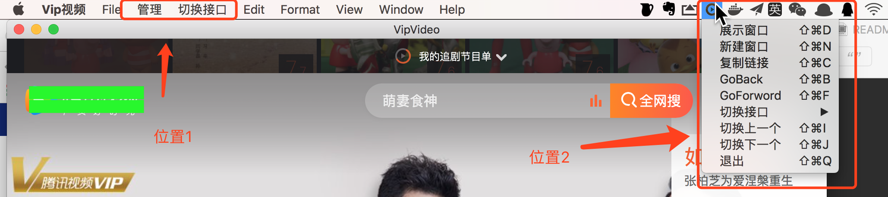
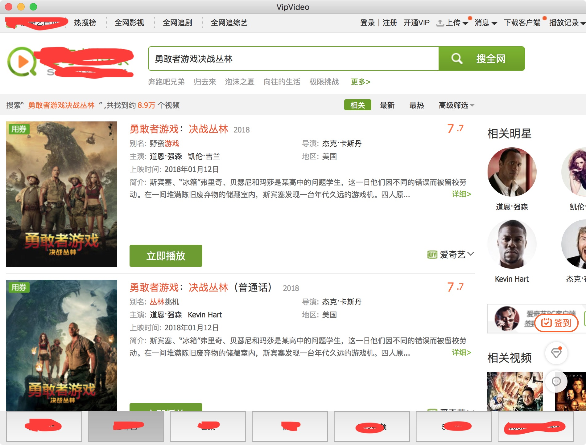
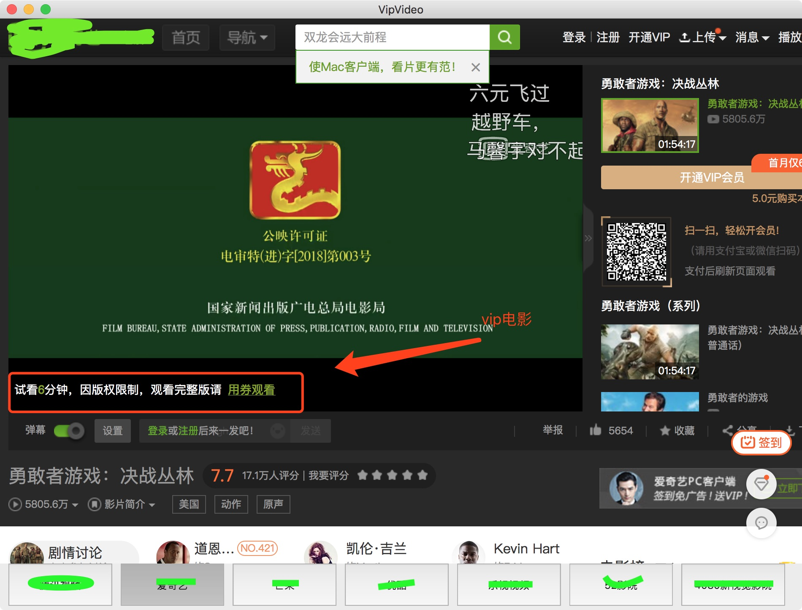
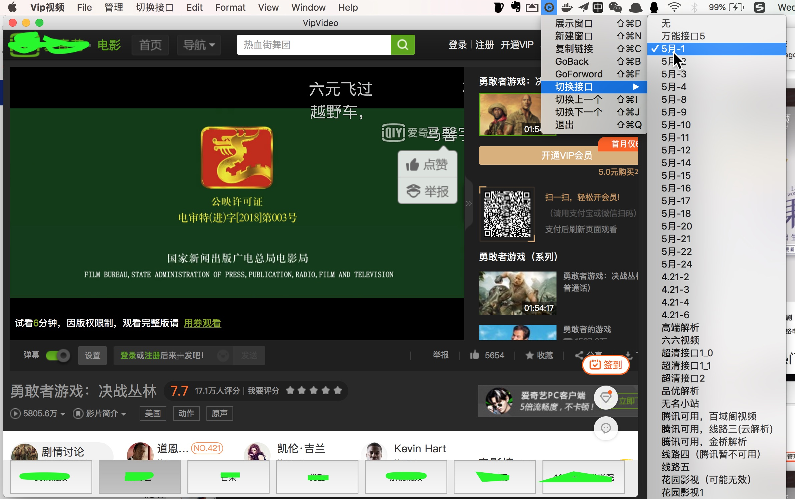
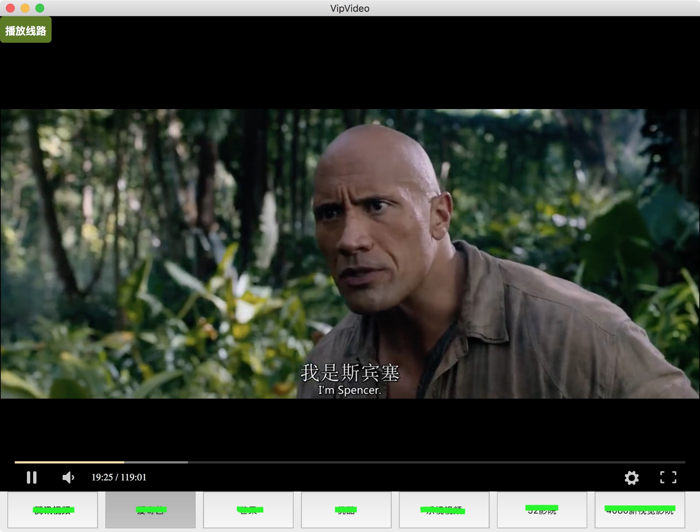
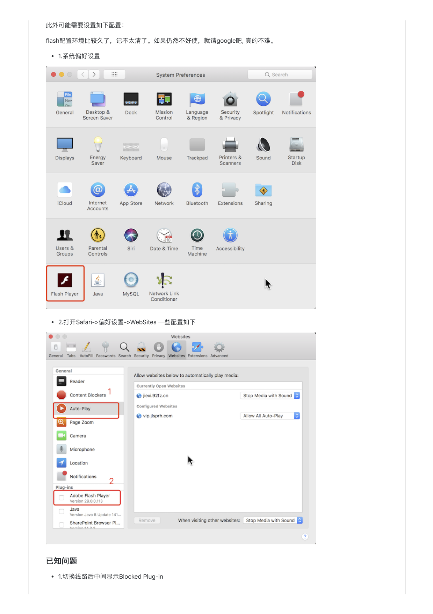
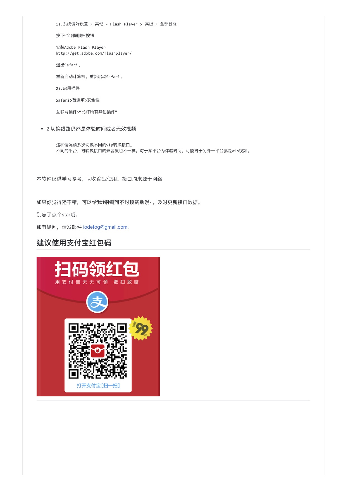

# VipVideo

----

各大网站vip视频免费观看

* 本软件仅供学习参考，切勿商业使用。接口数据均来源于互联网。如有侵权，请联系删除。

---

## VipVide For iPhone

[https://github.com/iodefog/VipVideo-iPhone.git](https://github.com/iodefog/VipVideo-iPhone.git)

---

## 软件功能介绍：
* 1.展示窗口
* 2.新建窗口
* 3.复制链接（用于分享或者浏览器播放）
* 4.GoBack
* 5.GoFoward
* 6切换vip接口
* 7.切换下一个（支持快捷键）
* 8.切换上一个（支持快捷键）
* 9.退出

---

### 主页


### 功能位


---

### 使用方法：

以vip电影《勇敢者游戏决战丛林》为例

* 1.搜索找到vip电影《勇敢者游戏决战丛林》


* 2.进入播放页面, 可以看到需要vip或者劵
 

* 3.利用“切换接口”转换成vip播放地址
 

* 4.可以看到切换后播放器时间已经变味119分钟。尽情享受吧
 

---

### 源码需配置

* VipURLManager.m 中，设置平台信息及解析url。格式参考viplist.json 文件。也可以直接配置viplist.json，不走网络。

```
#warning 这里是个假接口，请自行配置。也可以不处理。 对于viplist.json，最好自行网络收集解析地址补充。
#define HostURL @"http://www.xxx.com"

```

---

### 其他：
如果提示需要安装FlashPlayer才能播放。请先安装FlashPlayer及允许。

此外可能需要设置如下配置：
flash 配置环境比较久了，记不了太清。如果仍然不好使，请自行查找原因及解决问题。






---

* 应大家的要求，放出源码，仅供交流使用。
* 这里仅仅给出源码，接口已经移除。有需要的请自行配置url路径。
* 如果有需要我这边出接口的，请适当给一些赞助。赞助后，定期下发给vip转换url或者dmg。


---


如需联系或者合作，请发送邮件 [iodefog@gmail.com](mailto:iodefog@gmail.com)

QQ群：567503018
